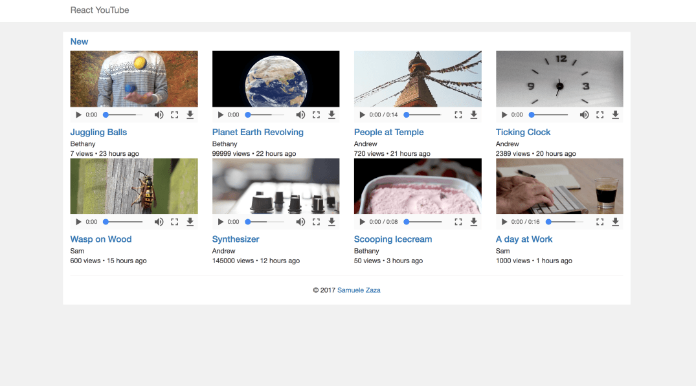
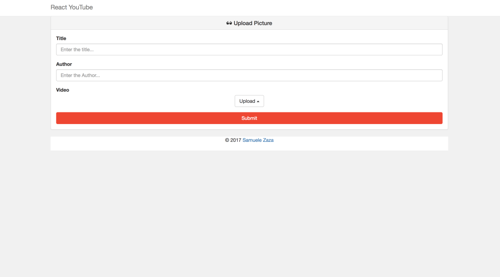

# ReactTubeApp
ReactTube App with React and Node.Js

## Overview
This is simple app to upload and share videos, in few words a youtube-like app.
Users can upload videos, share them throughout the app but the best feature is the video transcoding. Before being shared to public use the video is going to get transcoded thanks to Filestack.

## Prerequisites
The following tutorial is essentially a Javascript app written in React and Node.js

## Final Output - Screenshots
                      

